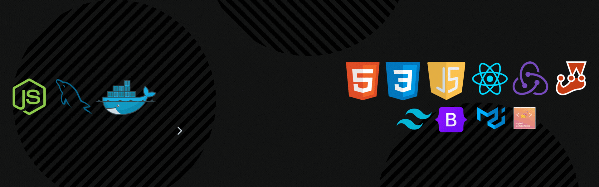

```JavaScript
const sobreMim = {
  nome: 'Vitor Nogueira',
  idade: '26',
  softSkills: [
    'Comunicação',
    'Adaptabilidade',
    'Resolução de problemas'
  ],
  hardSkills: [
    'HTML',
    'CSS',
    'JavaScript',
    'React'
  ],
};
```
<h1 align="center">Projetos</h1>

<table>
  <tr>
    <td valign="top" width="50%">
      <h2 align="center"><a href="https://github.com/vitor-nogueira-dev/netflix">🍿 Netflix</a></h2>
      <a href="https://netflix-vn.netlify.app/"></a>
      <br>
      <br>
      <p><em><strong>💡Tecnologias utilizadas:</strong> React (functional components), HTML, CSS, JavaScript, Material/UI, API Rest</em></p>
      <p>👨🏼‍💻 Clone da plataforma de streaming, Netflix</p>
    </td>
    <td valign="top" width="50%">
      <h2 align="center"><a href="https://github.com/vitor-nogueira-dev/calculator">🧮 Calculator</a></h2>
      <a href="https://calculator-vn.netlify.app/"></a>
      <br>
      <br>
      <p><em><strong>💡Tecnologias utilizadas:</strong> React (functional components), HTML, CSS, JavaScript</em></p>
      <p>👨🏼‍💻 Calculadora inspirada no modelo dos Iphones da Apple</p>
    </td>
  </tr>
  <tr>
    <td valign="top" width="50%">
      <h2 align="center"><a href="https://github.com/vitor-nogueira-dev/todolist-fullstack">📝 Full Stack Todo List</a></h2>
      <a href="https://github.com/vitor-nogueira-dev/todolist-fullstack"></a>
      <br>
      <br>
      <p><em><strong>💡Tecnologias utilizadas:</strong> Node.js, Express.js, HTML, CSS, JavaScript, MySQL, Docker</em></p>
      <p>👨🏼‍💻 Lista de tarefas que atualiza e é alimentada por um banco de dados MySQL</p>
    </td>
    <td valign="top" width="50%">
      <h2 align="center"><a href="https://github.com/vitor-nogueira-dev/trybe-tunes">🎧 Trybe Tunes</a></h2>
      <a href="https://trybetunes-vn.netlify.app/"></a>
      <br>
      <br>
      <p><em><strong>💡Tecnologias utilizadas:</strong> HTML, JavaScript, Styled Components, API Rest, React (class-based components)</em></p>
      <p>👨🏼‍💻 App de músicas</p>
    </td>
  </tr>
  <tr>
    <td valign="top" width="50%">
      <h2 align="center"><a href="https://github.com/vitor-nogueira-dev/gym-fitclub">🏋🏻 Fit Club</a></h2>
      <a href="https://fitclub-vn.netlify.app/"></a>
      <br>
      <br>
      <p><em><strong>💡Tecnologias utilizadas:</strong> HTML, CSS, React JS, JavaScript, Responsividade, Lib Email Js, React scroll, React framer motion</em></p>
      <p>👨🏼‍💻 Site moderno e responsivo de uma academia</p>
    </td>
    <td valign="top" width="50%">
      <h2 align="center"><a href="https://github.com/vitor-nogueira-dev/weekaway">✈️ WeekAway</a></h2>
      <a href="https://weekaway-vn.netlify.app/"></a>
      <br>
      <br>
      <p><em><strong>💡Tecnologias utilizadas:</strong> React (functional components), HTML, CSS, TailWind CSS, JavaScript, Lib React Icons</em></p>
      <p>👨🏼‍💻 Site de viagens responsivo estilizado com TailWind CSS</p>
    </td>
  </tr>
  <tr>
    <td valign="top" width="50%">
      <h2 align="center"><a href="https://github.com/vitor-nogueira-dev/game-trivia">🎮 Trivia Game</a></h2>
      <a href="https://game-trivia-grupo-28.netlify.app/"></a>
      <br>
      <br>
      <p><em><strong>💡Tecnologias utilizadas:</strong> HTML, REACT (class-based components), Redux, API Rest, Redux Thunk, localStorage, Styled Components</em></p>
      <p>👨🏼‍💻 Jogo de Trivia desenvolvido em grupo durante o curso de Desenvolvimento Web na Trybe</p>
    </td>
    <td valign="top" width="50%">
      <h2 align="center"><a href="https://github.com/vitor-nogueira-dev/react-testing-library">🧪 Testes com RTL(React Testing Library)</a></h2>
      <a href="https://github.com/vitor-nogueira-dev/react-testing-library"></a>
      <br>
      <p><em><strong>💡Tecnologias utilizadas:</strong> JavaScript, React, Lib RTL, Jest, Stryker Simulator</em></p>
      <p>👨🏼‍💻 Projeto de testes no Front-end com a React Testing Library - RTL</p>
    </td>
  </tr>
</table>
<br>
  
  
<div align="center">  
   
  
</div>


<p align="center">
  
</p>

<div align="center">  
<a href="https://www.instagram.com/vitornogueira_dev/" target="_blank">
</div> 
  
 
### HardSkills:
&nbsp;
&nbsp;
&nbsp;
&nbsp;
&nbsp;
&nbsp;
&nbsp;
  
### Ferramentas:
&nbsp;
&nbsp;
&nbsp;
&nbsp;
&nbsp;
&nbsp;
  
### Outros conhecimentos:
&nbsp; 
&nbsp;
&nbsp;
&nbsp;
&nbsp;
&nbsp;

  
### Estudando no momento:
&nbsp;
&nbsp;
&nbsp;
&nbsp;
&nbsp;

<div align="center">
<br><p align="centre"><b>Visitantes</b></p>  
<p align="center"></p> 
<br></div>


